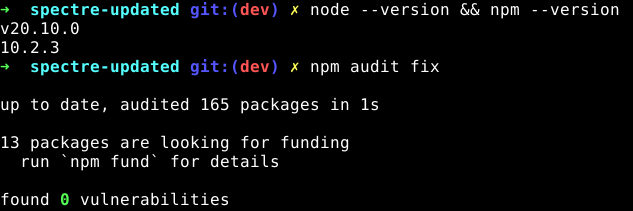
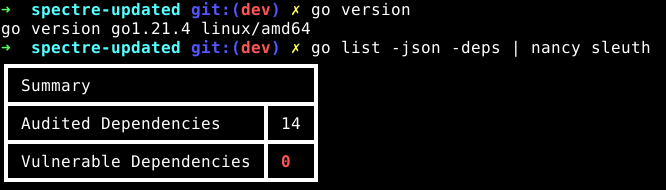

# Spectre/Ghostbin

This is a "Updated version" of Ghostbin/Spectre
 - Login/Password system work again
 - Golang 1.21.4
 - Node 20.10.0 LTS (npm 10.2.3)
 - go  module updated to latest version (go.mod)
 - npm module updated to latest version (package.json)

## changelog (YYYYMMDD)
#### 20231129
 - change name of default branch `v1-stable` --> `stable`
 - add tag `2.0` for the 20231129 update
 - add tag `1.0` for the 20220211 update
 - Updated golang 1.17 --> 1.21.4
 - Updated nodeJS 16.14.0 --> 20.10.0
 - Updated npm 8.3.1 --> 10.2.3
 - go  module updated to latest version (go.mod)
 - npm module updated to latest version (package.json)

#### 20220211
 - Fix Login/Password system
 - golang 1.17
 - nodeJS 16.14.0 LTS (npm 8.3.1)
 - go  module updated to latest version (go.mod)
 - npm module updated to latest version (package.json)

## Audit Security (20231129)

[Nancy tool to check vulnerabilities in Golang dependencies](https://github.com/sonatype-nexus-community/nancy)

## Debug install

just launch `install.sh`
